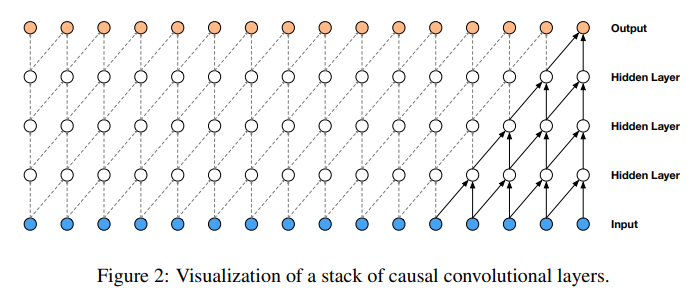

# Makemore

Makemore is a tiny character-level language model designed to generate sequences of characters based on input names. This project serves as a simple tool for generating name-like sequences using a character-level language model.

The data used for this lies [here](data/names.txt).

## Overview

Makemore operates on a character-by-character basis, taking names as input and producing a sequence of characters as output. It utilizes a language model to understand name patterns and generate plausible sequences based on the provided input.

Here, in this project, we tried to implement different approaches for the same neural network.

1. The [first](./1.%20from%20scratch/makemore-from-scratch.ipynb) approach is to generate a BiGram by simply counting the occurrences and using the most used ones to generate two letter sequences.

2. In the [second](./2.%20mlp%20architecture/build_makemore_mlp.ipynb) method, we implement an MLP architecture introduced to us through this paper : [A Neural Probabilistic Language Model](https://www.jmlr.org/papers/volume3/bengio03a/bengio03a.pdf).


3. The [third](./3.%20batch%20normalization/build_makemore_bn.ipynb) method includes, introducing the the ideas of:

 > Adjusting the weights and biases of the nn. [Research Paper](https://arxiv.org/abs/1502.01852)

 > Batch normalization for input size of the neural network. [Research Paper](https://arxiv.org/abs/1502.03167)

4. The [fourth](./4.%20manual%20backpropogation/build_makemore_backprop.ipynb) one includes exercises to make you a backpropagation ninja by manually implementing them.

> This shows how backpropagation was done back in the early days. Also has the side effect of giving you a sense of superiority over other practitioners of Deep Learning.


5. The [fifth](./5.%20wavenet%20architecture/build_makemore_wavenet.ipynb) notebook includes the implementation of WaveNet architecture from this paper: [WaveNet: A Generative Model for Raw Audio](https://arxiv.org/pdf/1609.03499v2.pdf)



## Clone the repo

```bash
git clone https://github.com/iamharshvardhan/makemore-from-scratch.git
```

## Acknowledgments

**This project was made possible because of these <a href="https://www.youtube.com/playlist?list=PLAqhIrjkxbuWI23v9cThsA9GvCAUhRvKZ">lectures</a> by _Andrej Karpathy_ (Lecture 2 to 6), and <a href="https://www.youtube.com/playlist?list=PL3FW7Lu3i5JvHM8ljYj-zLfQRF3EO8sYv">Stanford's cs231n course</a>.**

## License

This project is licensed under the MIT License. See the [LICENSE](LICENSE) file for details.
